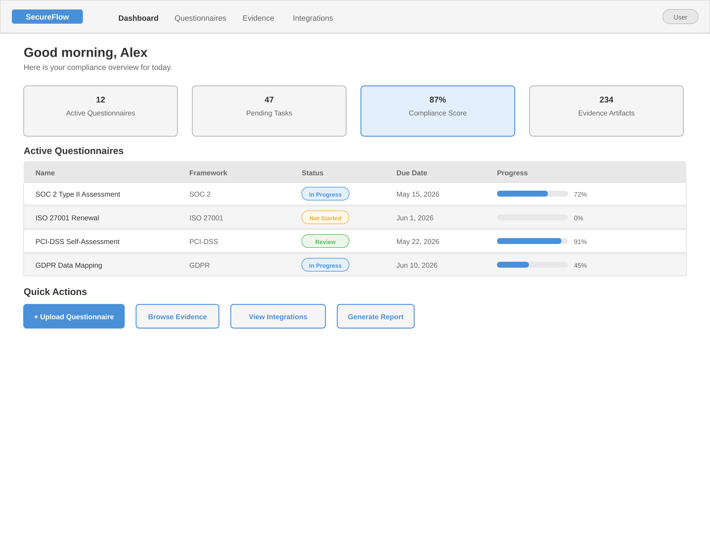
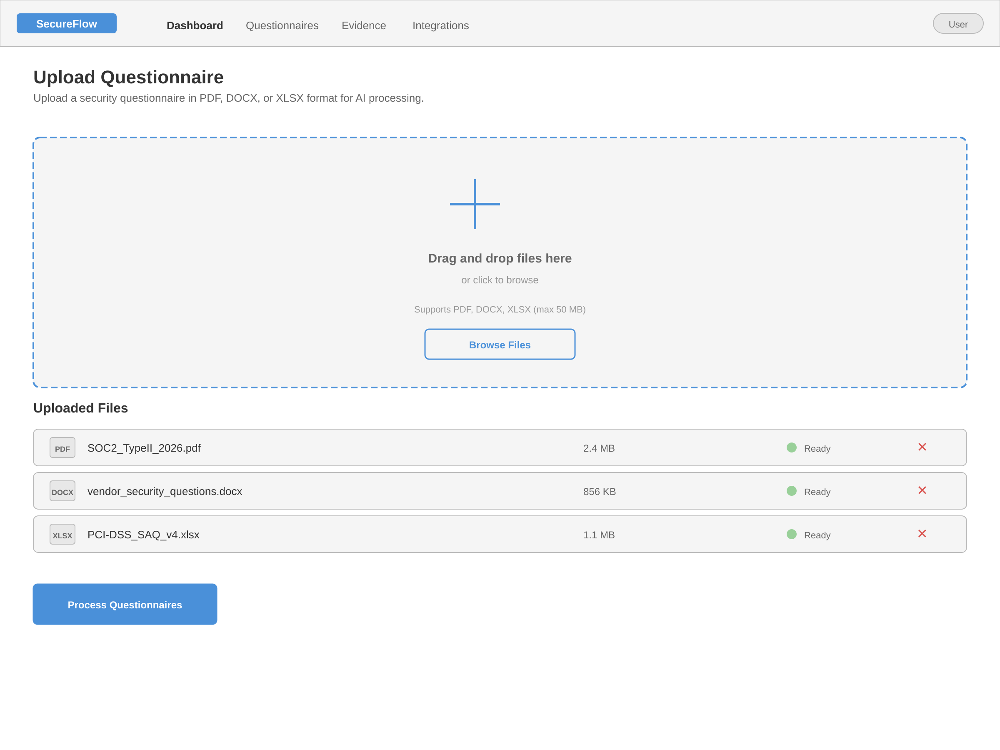
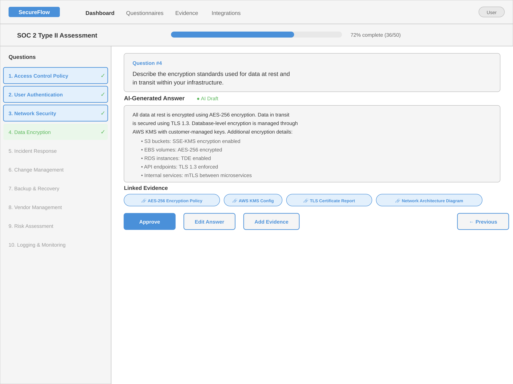
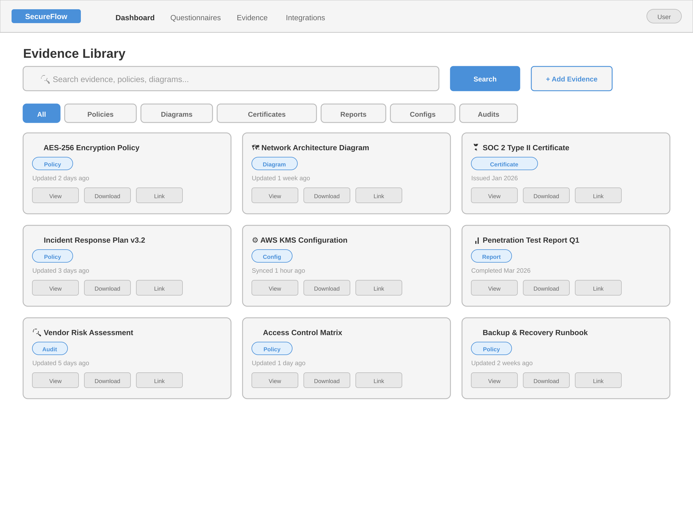
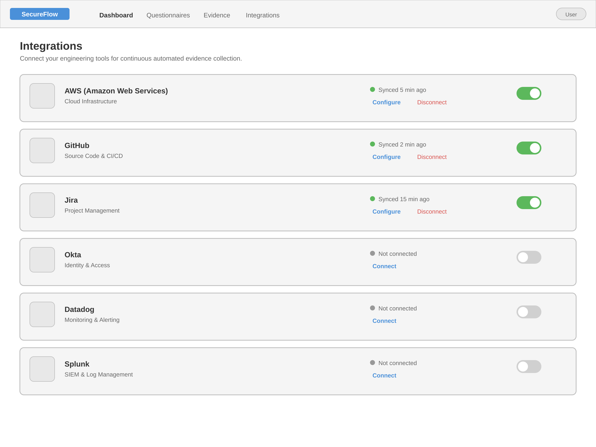
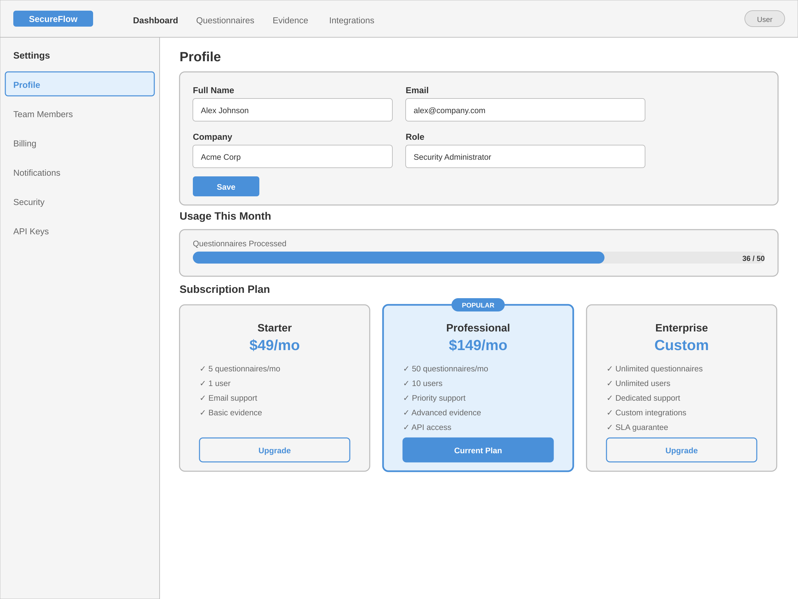

# Wireframes

Pencil wireframe previews for the SecureFlow compliance platform.

- **Dashboard** — Central hub displaying active security questionnaires, pending tasks, and overall compliance status.

  

- **Questionnaire Upload** — Interface for users to upload new security questionnaires (PDF, DOCX, XLSX) for AI processing.

  

- **Questionnaire Responder** — Interactive editor displaying AI-generated answers mapped to original questions with linked evidence.

  

- **Evidence Library** — Searchable repository for managing security policies, architectural diagrams, and generated proof artifacts.

  

- **Integrations Settings** — Configuration screen to connect engineering tools (AWS, GitHub, Jira) for continuous automated evidence collection.

  

- **Billing and Account** — Administrative screen for managing user profiles, team members, and monthly SaaS subscription tiers.

  

